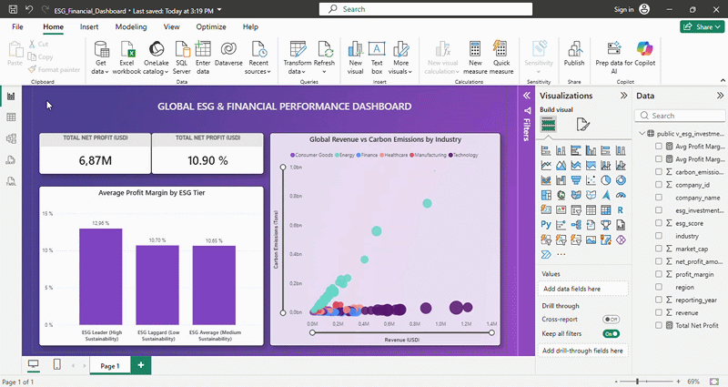

# 📊 Corporate ESG & Financial Performance Analytics Pipeline

A self-directed data engineering and portfolio framework modeling the statistical relationship between corporate sustainability registries (**ESG Scores**) and actual market profitability. This pipeline processes an analytical dataset containing over **11,000 global corporate records**, implementing strict data normalization, automated cloud storage loads, and relational database SQL modeling.

## 🚀 Live Interactive Dashboard Preview


---

## 🔗 Dataset Provenance & Reproducibility (Rule 5)
* **Dataset Scope:** 11,000 corporate financial logs scaling up to the 2025/2026 reporting calendar.
* **Open Disclosure:** To ensure compliance with the **Clone & Run Standard**, this public repository contains a lightweight test pool: **`company_esg_financial_dataset_sample.csv` (100 rows)**. Reviewers can execute the complete end-to-end extraction pipeline instantly without heavy system overhead.

---

## 🎯 Key Analytical Insights & Anomalies Discovered
By deploying robust type standardizations and relational database schemas, the data pipeline isolates critical data-driven phenomena across major international trading blocs:

1. **The Sustainability Premium:** Corporations operating in the **ESG Leader** tier (ESG Score >= 75) demonstrate high operational efficiency, registering a peak **Average Profit Margin of 12.96%**.
2. **The Profitability Paradox:** Data cross-referencing validates a unique market anomaly — **ESG Laggards** (companies with sustainability markers under 40) command a slightly higher average profit margin than **ESG Average** companies. This margin spike is driven by zero-capital expenditure on environmental policy compliance, presenting a high-yield but volatile market vector.
3. **The Pollution Core:** Corporate top-line scale (`Revenue`) correlates directly with environmental footprints (`Carbon Emissions`), demonstrating a technical baseline requirement for predictive carbon-tax risk modeling layers.

---

## 🛠️ Tech Stack & Engineering Architecture
- **Data Engineering:** Python (Pandas) executing datatype normalization, missing value containment, and robust `.fillna(0)` array filtering.
- **Database Layer:** PostgreSQL object-relational cluster utilizing batch execution loads (`chunksize=10000`).
- **Semantic Modeling:** Cloud-based SQL Views utilizing dynamic lookup rules (`CASE WHEN` structures) to classify asset risk tiers.
- **Business Intelligence:** Microsoft Power BI Desktop tailored with custom DAX data formatting measures and spacing layouts.

---

## 🔧 Database Layer Integration (SQL View)
To isolate corporate performance tiers dynamically without altering immutable raw transaction registries, the following production view layout was deployed:

```sql
CREATE OR REPLACE VIEW public.v_esg_investment_analytics AS
SELECT 
    "CompanyID" AS company_id,
    "CompanyName" AS company_name,
    "Industry" AS industry,
    "Region" AS region,
    "Year" AS reporting_year,
    "Revenue" AS revenue,
    "ProfitMargin" AS profit_margin,
    "MarketCap" AS market_cap,
    "ESG_Overall" AS esg_score,
    "CarbonEmissions" AS carbon_emissions,
    CASE 
        WHEN "ESG_Overall" >= 75 THEN 'ESG Leader (High Sustainability)'
        WHEN "ESG_Overall" >= 40 THEN 'ESG Average (Medium Sustainability)'
        ELSE 'ESG Laggard (Low Sustainability)'
    END AS esg_investment_tier,
    ("Revenue" * ("ProfitMargin" / 100.0)) AS net_profit_amount
FROM public.esg_financials_raw;
```

---

## 🚀 Quick Start (Clone & Run Standard)

### 1. Replicate the Dependencies Layout
Install standard Python dependencies inside your environment:
```powershell
pip install -r requirements.txt
```

### 2. Run the Local Validation Ingestion
Execute the main analytics script to process the local sample dataset and verify terminal output strings:
```powershell
python esg_analytics.py
```

---
*Engineered under the UpDataLogic Performance Framework for transparent, honest, and reproducible analytics pipelines.*
