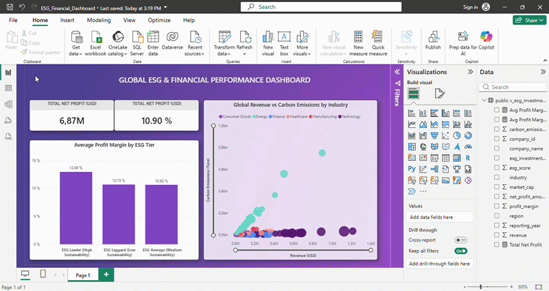

# Corporate ESG & Financial Performance Analytics Pipeline

[](https://github.com/jurajpijakdata/esg-financial-analytics/actions/workflows/tests.yml)



A data pipeline that models the relationship between corporate ESG (Environmental, Social, Governance) scores and financial performance. It cleans messy raw financial figures, validates them, and loads them into a relational warehouse so they can be analyzed together -- for example, whether higher-ESG companies also tend to be more profitable, or how revenue scales with carbon emissions.

All data in this project is synthetic, modeling realistic company financials and ESG scores without using any real company's data.

## What problem this solves

Raw financial exports are messy: numbers can carry thousands separators, missing fields show up as blank strings, and -- specific to this dataset -- each company reports once per year, so a company's records only make sense as a time series, not a single snapshot. This pipeline:

1. Parses every numeric field safely with Python's `Decimal` type, so accounting figures never drift from binary floating-point rounding.
2. Quarantines rows with unparseable financial data (`NULL` + a `data_quality_status` flag) instead of silently defaulting them to zero, which would skew every downstream average.
3. Keys every row on `(CompanyID, Year)` together, not `CompanyID` alone, because each company has one row per reporting year. Keying on `CompanyID` alone means every later year silently overwrites the earlier one on each run -- a 100-row sample would collapse down to 10 surviving rows, one per company, with the entire year-over-year history destroyed.
4. Loads the full record -- financials **and** the ESG/environmental scores (`ESG_Overall`, `ESG_Environmental`, `ESG_Social`, `ESG_Governance`, `CarbonEmissions`, `WaterUsage`, `EnergyConsumption`) -- into the warehouse, since those scores are the actual subject of the analysis.

## How it's built

**Idempotent loads.** The pipeline uses `INSERT ... ON CONFLICT (CompanyID, Year) DO UPDATE` instead of `replace` or blind `append`, so it can be re-run on the same data without creating duplicates.

**One source of truth for the transformation logic.** Numeric parsing lives in a single tested module (`esg_parser.py`), used by both `esg_analytics.py` and `esg_ingestion.py`, so a given raw value is interpreted the same way no matter which script processes it.

**Decimal-safe money handling.** Financial and ESG figures are parsed with Python's `Decimal` type and stored as `NUMERIC(18,4)` in Postgres.

**Quarantine over silent failure.** Rows with unparseable numeric fields get `NULL` and a `data_quality_status = 'UNKNOWN'` flag instead of a false zero. If more than 25% of a run's rows fail validation, the ingestion pipeline stops and exits non-zero rather than loading a bad batch quietly; the analytics script uses a tighter 5% threshold since it's meant to catch problems earlier, before anything reaches the warehouse.

**Schema validation.** `pandera` checks the shape and types of the data before anything is written or analyzed.

**Tested business logic.** The parsing and classification logic is isolated in its own module and covered by a parametrized pytest suite, plus integration tests that run both pipeline scripts end to end against a clean environment. Tests run automatically in CI on every push (see the badge above).

**Bulk loads.** The load step batches rows into chunked bulk upserts (1,000 rows per round-trip) rather than issuing one database call per row.

## Repository structure

```text
esg-financial-analytics/
├── esg_parser.py                             # Parsing & classification logic (unit tested)
├── esg_analytics.py                          # Local analytics: validates & summarizes the sample dataset
├── esg_ingestion.py                          # Loads validated data into Postgres (or local SQLite fallback)
├── test_esg.py                               # Pytest suite for esg_parser.py
├── test_esg_pipeline.py                      # Integration tests that run both scripts end to end
├── create_tables.sql                         # Postgres schema, reporting view, and RLS policy
├── company_esg_financial_dataset_sample.csv  # 100-row sample dataset (10 companies x ~10 years each)
├── requirements.txt                          # Pinned dependencies
├── .github/workflows/tests.yml               # CI: runs the test suite on every push/PR
├── LICENSE
└── README.md
```

## Database layer

`create_tables.sql` creates the `esg_financials_raw` table (keyed on `CompanyID` + `Year`), a reporting view, and a Row-Level Security policy for the `authenticated` Supabase role. Run it once against a fresh Postgres/Supabase database before pointing `esg_ingestion.py` at real credentials:

```sql
CREATE OR REPLACE VIEW public.v_esg_investment_analytics AS
SELECT
    "CompanyID" AS company_id,
    "CompanyName" AS company_name,
    "Industry" AS industry,
    "Region" AS region,
    "Year" AS reporting_year,
    "Revenue" AS revenue,
    "ProfitMargin" AS profit_margin,
    "MarketCap" AS market_cap,
    "ESG_Overall" AS esg_score,
    "CarbonEmissions" AS carbon_emissions,
    CASE
        WHEN "ESG_Overall" >= 75 THEN 'ESG Leader (High Sustainability)'
        WHEN "ESG_Overall" >= 40 THEN 'ESG Average (Medium Sustainability)'
        ELSE 'ESG Laggard (Low Sustainability)'
    END AS esg_investment_tier,
    ("Revenue" * ("ProfitMargin" / 100.0)) AS net_profit_amount
FROM public.esg_financials_raw;
```

## Quick start

### 1. Install dependencies

```bash
pip install -r requirements.txt
```

### 2. Run the test suite

```bash
pytest -v
```

### 3. (Optional) Configure database credentials

Copy `.env.example` to `.env` and fill in your Supabase/Postgres connection details, then run `create_tables.sql` against that database once.

If you skip this step, `esg_ingestion.py` automatically falls back to a local SQLite database, so you can run everything end to end with no cloud credentials.

### 4. Run the analytics script

```bash
python esg_analytics.py
```

Validates the sample dataset and prints average profit margin by industry.

### 5. Run the ingestion pipeline

```bash
python esg_ingestion.py
```

Loads the sample dataset into your configured database (or the local SQLite fallback).

## Data protection note

This project uses only synthetic, randomly generated data -- no real company or personal information is processed anywhere in the pipeline.

---
*Engineered under the UpDataLogic framework for transparent, honest, and reproducible analytics pipelines.*
